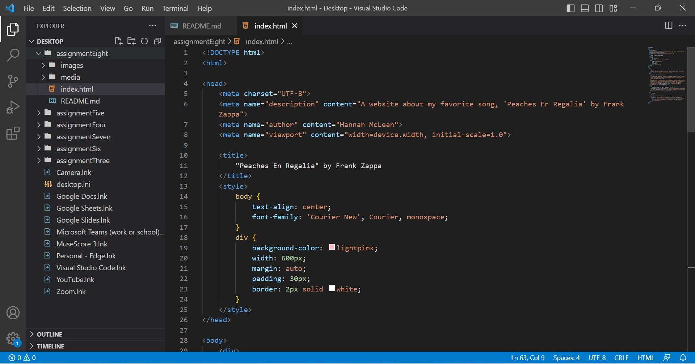

In general, an affordance is the possible function or purpose of a thing. In real life, a thing can have multiple affordances. But when it comes to the digital world, it's most common for a button or any interactive icon to have one affordance or function. 
Advantages for using third-party options are you can host large, high-quality versions of files and it will handle compatibility, encoding, and other details necessary for it to play on different browers. Disadvantages are any unlicensed marterials used without permission can be crawled and reported and it can become costly to upgrade storage and/or services. 

 