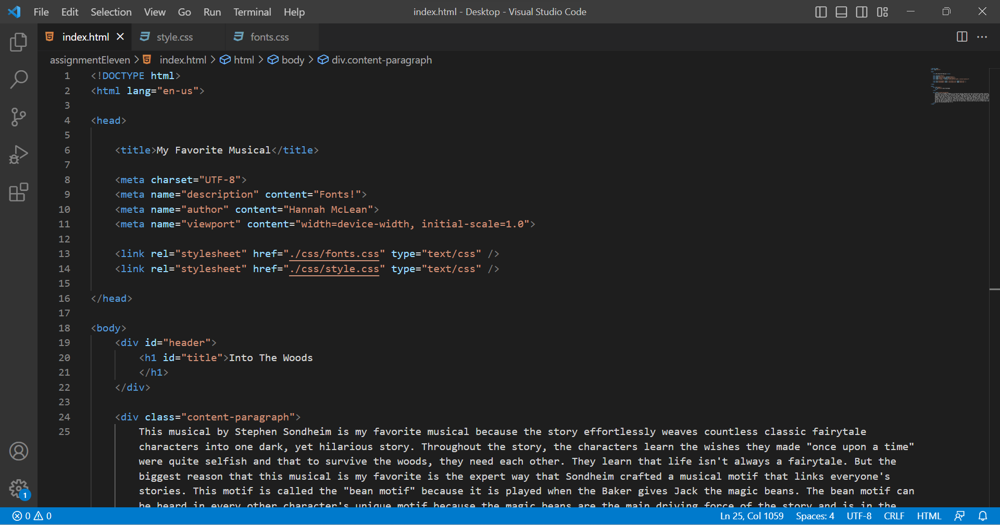

Typography is the creative design of the text on a web page, including font pairings and letter format and design. 
Having fallback fonts or a font stack give you the best chance of your website looking the way you want it to across all visitors' platforms. You can be sure that there are a couple font choices that will be attempted rather than immediately defaulting to the basic serif font.
System fonts and web-safe fonts are fonts that are assumed to be on the vast majority of users' devices so they don't need to be downloaded. Web fonts are hosted on the web and then are downloaded by the browser while rendering the web page. There are more web fonts than system fonts. 

