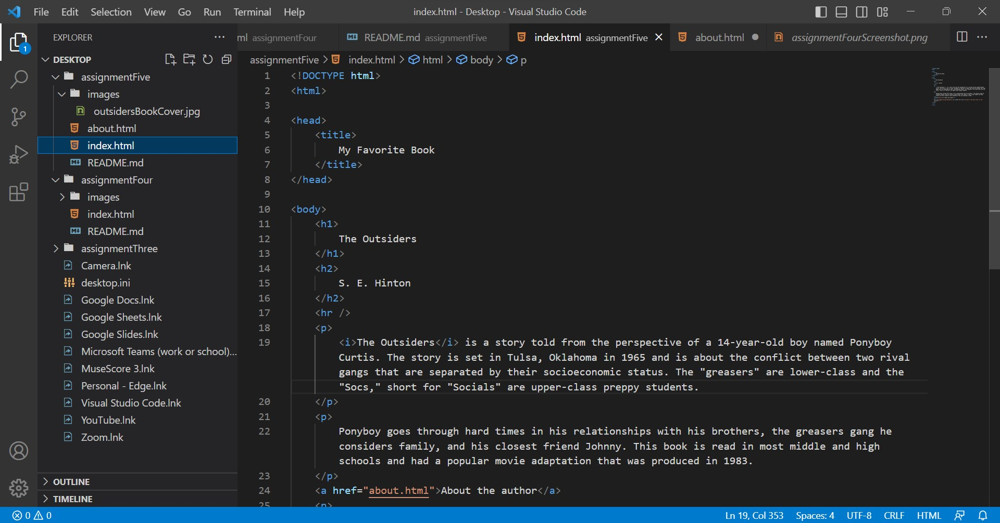

I chose to look at the website YouTube in the year 2009.
Everything on the old version of the website looks smaller. It's kind of hard to navigate because the words and video thumbnails are small. The focus of the website is the videos, but they feel insignificant because of how small they are compared to how big the screen is. It does show featured and spotlight videos first and there are a couple tabs to get to where you want to go, like videos and channels. These factors are similar to the YouTube website now. But other than the videos themselves, there's not much life or color to the website. 

 