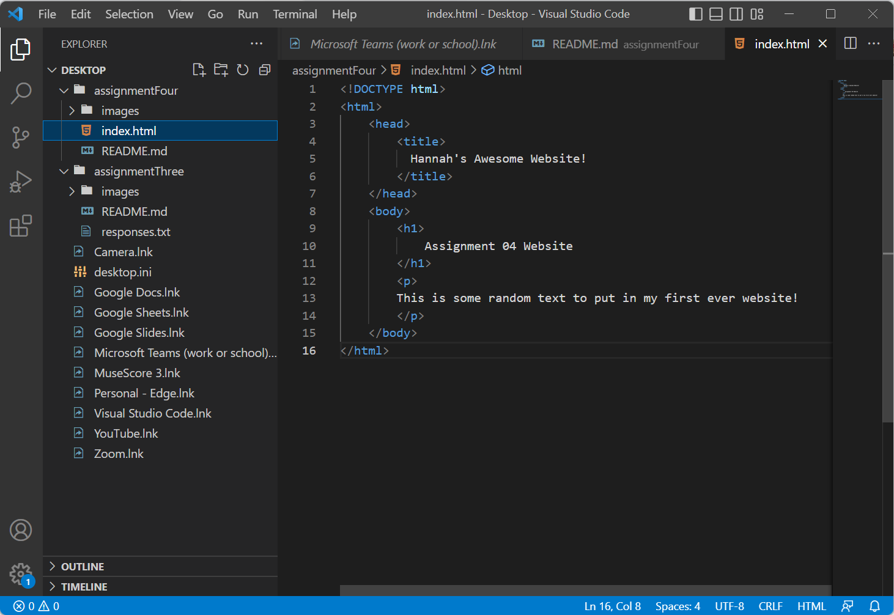

Browsers translate and render instructions from web languages like HTML, CSS, and JavaScript into intended layouts of text, graphics, and other content. 

I use Google Chrome and Safari on my iPhone to browse the web almost every day. 

