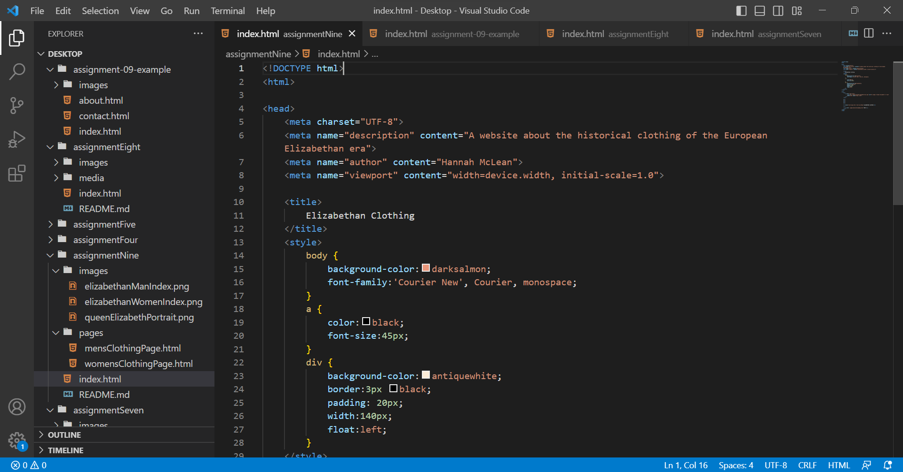

For me, every aspect of learning HTML has been new and almost all the aspects have been difficult. It's been kind of hard to get use to all of the different rules, and I do have to constantly refer to my notes and previous assignments to remember how everything works. But I think I'm slowly catching on week by week. 
I think I'm excited to learn more about different things on websites are positioned. I'm thinking about common websites that I visit and I wonder how they get the different aspects of their website to be a quarter of the way across the screen, for example. I'm also interested in learning more ways to involve color in the websites.

 