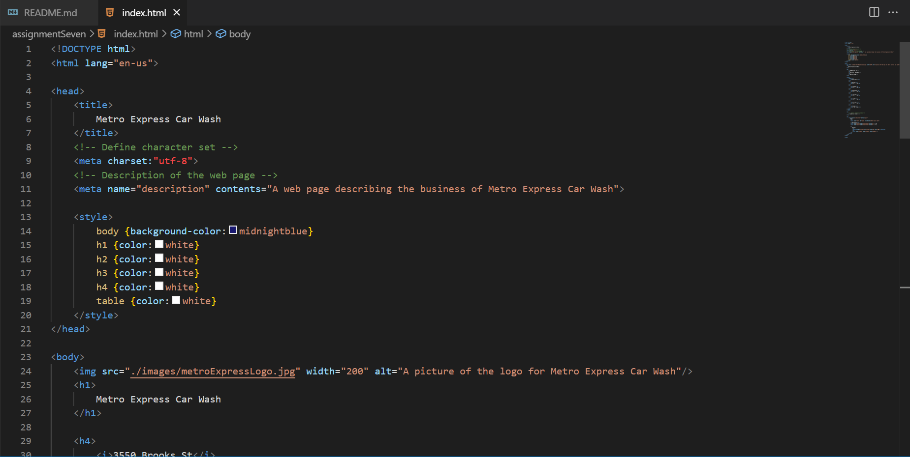

Across the web, I don't remember that many forms on websites, but when I applied for my current job, the application was online so there were dropdown options and text entries. The purpose of these were to acquire my personal information for the owners of the business to look at. In a not-so-formal instance of this as well, these forms create an element of interactibility for website users. 

