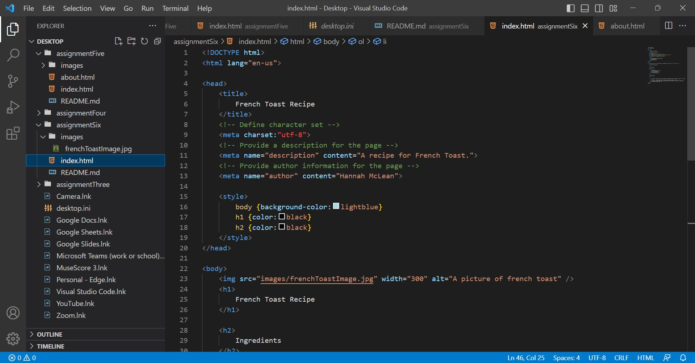

Structural markup embeds information about the structure of a document. Elements in structural markup include headings, paragraphs, breaks, and lists. 

Semantic markup is used to reinforce the meaning of the information in a document. It can be used to place emphasis on words or phrases. 

 