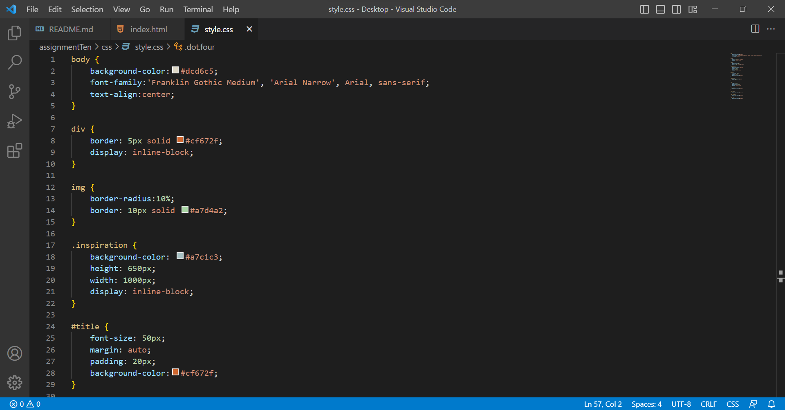

The universal selector is used to style every element on a page. The element selector is used to select all elements of a certain type by using an element name. Class selectors select elements assigned to different classes because they serve the same function. ID selectors allow developers to define style rules for a specific element by calling its unique ID. Choosing one over the other depends on what kind of content and how many different kinds of content are involved in the website. If there are more different and unique types of elements, universal selectors wouldn't be as helpful. 
I chose my colors for this assignment by looking at one of my favorite paintings: "The Birth Of Venus" by Sandro Botticelli. I liked the mostly pale colors from the painting, like the light pale green of the ocean, the light pinkish-red in the cloth, as well as the contrasting darker brown and green of the trees and grass in the background. The seemingly neutral, pale tones go together really beautifully. 

 