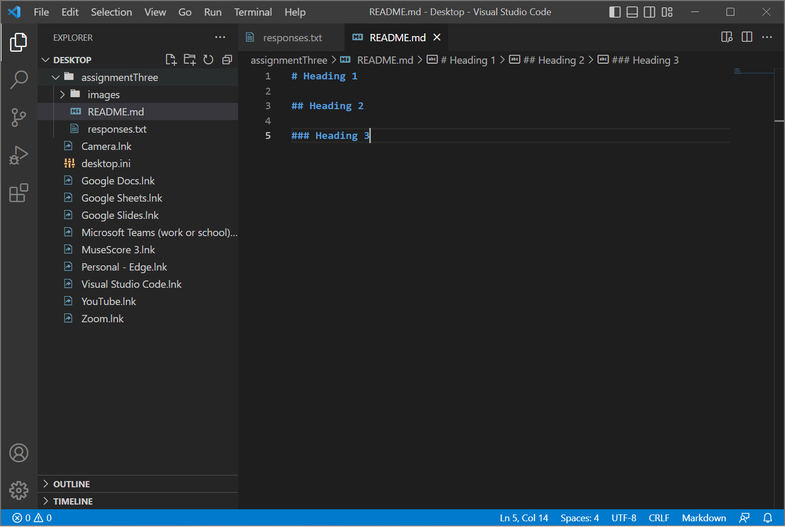

# Heading 1

## Heading 2

### Heading 3

One thing I learned in this class is that the internet and the world wide web are not the same thing. A second thing I've learned is how the types of image files actually serve a purpose and make a difference. A third thing I've learned is that the internet all over the world is connected by cords that run through the ocean. 

[OpenSourceShakespeare](https://www.opensourceshakespeare.org/views/plays/plays.php)

[My File](./responses.txt)

