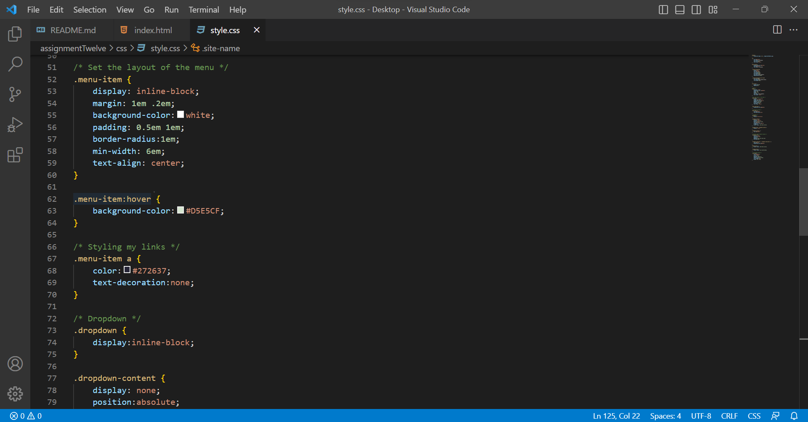

Padding is the amount of space between the inner content of the element and the element itself. The margin is the space between the box/element and other elements, or the edge of the parent element. Borders are more of a visual styling tool than a space management tool. The width, style, and color of a border can be changed to outline an element. 

